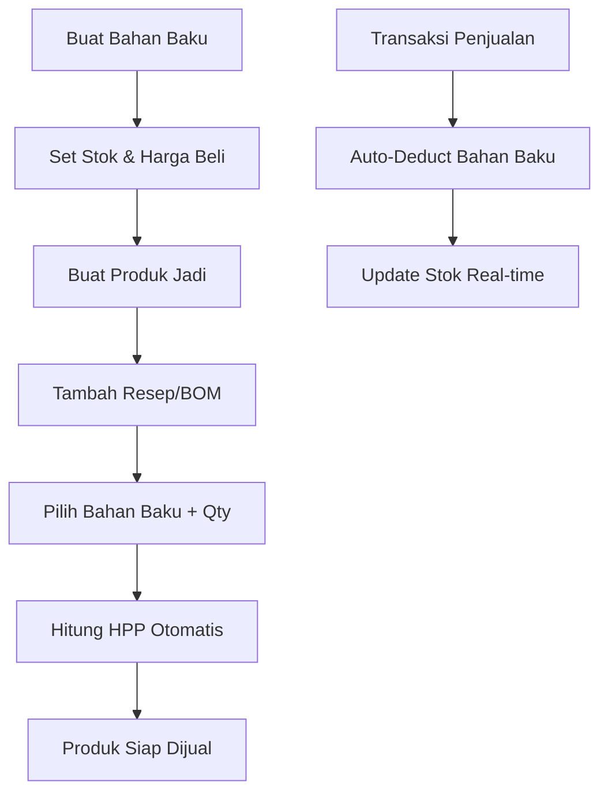
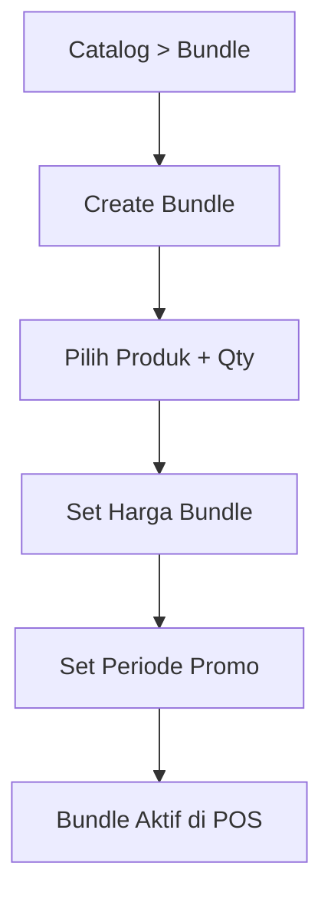
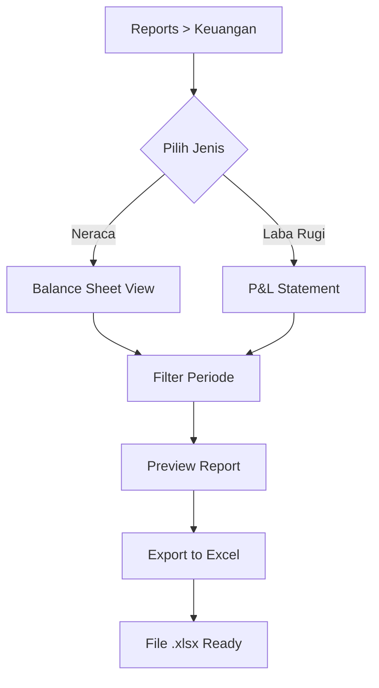
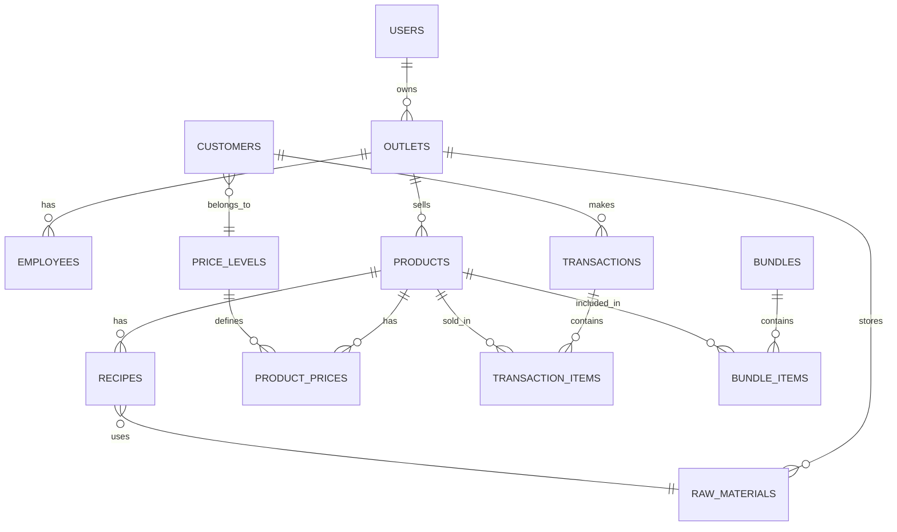

# Product Requirement Document (PRD)
## MPI - Managemen Produksi Terintegrasi

---

## 1. Executive Summary

### 1.1 Tentang MPI
**MPI (Managemen Produksi Terintegrasi)** adalah sistem manajemen bisnis all-in-one yang dirancang khusus untuk **UMKM dan IKM** di Indonesia. MPI menggabungkan fitur POS modern dengan manajemen produksi, inventory terintegrasi, dan pelaporan keuangan yang compliance dengan regulasi pajak.

### 1.2 Target Pengguna
| Segmen | Deskripsi | Contoh |
|--------|-----------|--------|
| **UMKM** | Usaha Mikro Kecil Menengah | Toko kelontong, warung makan, bakery |
| **IKM** | Industri Kecil Menengah | Produsen makanan, konveksi, kerajinan |
| **Home Industry** | Usaha rumahan dengan produksi | Catering, kue kering, frozen food |

### 1.3 Masalah yang Diselesaikan

> [!IMPORTANT]
> **Pain Points Utama UMKM/IKM:**
> 1. **Tidak ada tracking bahan baku** - Sulit menghitung HPP (Harga Pokok Produksi)
> 2. **Pricing chaos** - Harga berbeda untuk reseller/agen sulit dikelola
> 3. **Customer retention lemah** - Tidak ada sistem loyalitas
> 4. **Laporan keuangan manual** - Repot saat lapor pajak
> 5. **Inventory terpisah** - Stok produk jadi & bahan baku tidak sinkron

---

## 2. Feature Overview

### 2.1 Core Features Matrix

| Module | Feature | Priority | Source |
|--------|---------|----------|--------|
| **Catalog** | Manajemen Produk & Kategori | P0 | Hitachi |
| **Catalog** | Resep Produksi (BOM) | P0 | 🆕 MPI |
| **Catalog** | Bundle Produk (Promo) | P0 | 🆕 MPI |
| **Pricing** | Multi-Level Pricing (4 tier) | P0 | 🆕 MPI |
| **Pricing** | Custom Level Names | P0 | 🆕 MPI |
| **Customer** | Sistem Poin & Level | P0 | 🆕 MPI |
| **Customer** | Customer Management | P1 | Hitachi |
| **Inventory** | Stok Produk Jadi | P0 | Hitachi |
| **Inventory** | Stok Bahan Baku | P0 | 🆕 MPI |
| **Inventory** | Auto-deduct dari Resep | P0 | 🆕 MPI |
| **Reports** | Laporan Penjualan | P1 | Hitachi |
| **Reports** | Neraca (Balance Sheet) | P0 | 🆕 MPI |
| **Reports** | Laba Rugi (P&L) | P0 | 🆕 MPI |
| **Reports** | Export Excel (Tax) | P0 | 🆕 MPI |
| **POS** | Transaksi & Pembayaran | P1 | Hitachi |
| **Employee** | Manajemen Karyawan | P2 | Hitachi |
| **Config** | Multi-Outlet Support | P2 | Hitachi |

---

## 3. User Flows

### 3.1 Flow Resep Produksi



**Detail Steps:**
1. **Buat Bahan Baku** → Catalog > Bahan Baku > Create
2. **Input Data** → Nama, satuan, harga beli, stok awal
3. **Buat Produk** → Catalog > Produk > Create
4. **Tambah Resep** → Tab "Resep" pada form produk
5. **Pilih Bahan** → Multi-select bahan baku + quantity per produk
6. **HPP Calculated** → System auto-hitung dari (Σ qty × harga bahan)
7. **Set Harga Jual** → Input per level (Retail, Reseller, Agen, Distributor)

### 3.2 Flow Multi-Level Pricing


| Step | Aksi | Detail |
|------|------|--------|
| 1 | Buka Configuration > Price Levels | Setup nama level |
| 2 | Buat Level: Retail, Reseller, Agen, Distributor | Max 4 level |
| 3 | Set Poin Requirement | Min poin untuk naik level |
| 4 | Buat Customer Baru | Assign level awal (Retail) |
| 5 | Customer Belanja | Dapat poin per nominal |
| 6 | Level Auto-Upgrade | Ketika poin mencukupi |
| 7 | Harga Otomatis | Sesuai level saat transaksi |

### 3.3 Flow Bundle Promo



### 3.4 Flow Laporan Keuangan



---

## 4. Data Structure

### 4.1 Entity Relationship Diagram



### 4.2 Database Schema

#### Core Tables

```sql
-- ===============================
-- USER & OUTLET MANAGEMENT
-- ===============================

users (
    id              UUID PRIMARY KEY,
    email           VARCHAR(255) UNIQUE NOT NULL,
    phone           VARCHAR(20),
    password_hash   VARCHAR(255) NOT NULL,
    name            VARCHAR(100),
    role            ENUM('owner', 'admin', 'staff'),
    created_at      TIMESTAMP DEFAULT NOW()
);

outlets (
    id              UUID PRIMARY KEY,
    owner_id        UUID REFERENCES users(id),
    name            VARCHAR(100) NOT NULL,
    address         TEXT,
    phone           VARCHAR(20),
    settings        JSONB DEFAULT '{}',
    created_at      TIMESTAMP DEFAULT NOW()
);

employees (
    id              UUID PRIMARY KEY,
    outlet_id       UUID REFERENCES outlets(id),
    name            VARCHAR(100) NOT NULL,
    email           VARCHAR(255),
    pin_code        VARCHAR(6),
    role            VARCHAR(50),
    commission_pct  DECIMAL(5,2) DEFAULT 0,
    is_active       BOOLEAN DEFAULT true
);
```

#### Catalog & Recipe (🆕 MPI)

```sql
-- ===============================
-- BAHAN BAKU (RAW MATERIALS)
-- ===============================

raw_materials (
    id              UUID PRIMARY KEY,
    outlet_id       UUID REFERENCES outlets(id),
    sku             VARCHAR(50),
    name            VARCHAR(100) NOT NULL,
    unit            VARCHAR(20) NOT NULL,      -- kg, liter, pcs
    purchase_price  DECIMAL(15,2) NOT NULL,    -- Harga beli
    stock_qty       DECIMAL(15,3) DEFAULT 0,
    min_stock       DECIMAL(15,3) DEFAULT 0,
    supplier_id     UUID REFERENCES suppliers(id),
    created_at      TIMESTAMP DEFAULT NOW()
);

-- ===============================
-- PRODUK JADI (FINISHED GOODS)
-- ===============================

products (
    id              UUID PRIMARY KEY,
    outlet_id       UUID REFERENCES outlets(id),
    sku             VARCHAR(50),
    name            VARCHAR(100) NOT NULL,
    description     TEXT,
    category_id     UUID REFERENCES categories(id),
    brand_id        UUID REFERENCES brands(id),
    base_price      DECIMAL(15,2) NOT NULL,    -- Harga retail
    cost_price      DECIMAL(15,2),             -- HPP (auto-calculated)
    stock_qty       DECIMAL(15,3) DEFAULT 0,
    track_inventory BOOLEAN DEFAULT true,
    has_recipe      BOOLEAN DEFAULT false,
    image_url       VARCHAR(500),
    is_active       BOOLEAN DEFAULT true,
    created_at      TIMESTAMP DEFAULT NOW()
);

-- ===============================
-- RESEP PRODUKSI (BOM)
-- ===============================

recipes (
    id              UUID PRIMARY KEY,
    product_id      UUID REFERENCES products(id) ON DELETE CASCADE,
    raw_material_id UUID REFERENCES raw_materials(id),
    quantity        DECIMAL(15,4) NOT NULL,    -- Qty bahan per 1 produk
    unit            VARCHAR(20),
    notes           TEXT,
    UNIQUE(product_id, raw_material_id)
);

-- View untuk HPP calculation
CREATE VIEW product_hpp AS
SELECT 
    p.id as product_id,
    p.name,
    COALESCE(SUM(r.quantity * rm.purchase_price), 0) as hpp
FROM products p
LEFT JOIN recipes r ON r.product_id = p.id
LEFT JOIN raw_materials rm ON rm.id = r.raw_material_id
GROUP BY p.id, p.name;
```

#### Multi-Level Pricing (🆕 MPI)

```sql
-- ===============================
-- PRICE LEVELS
-- ===============================

price_levels (
    id              UUID PRIMARY KEY,
    outlet_id       UUID REFERENCES outlets(id),
    name            VARCHAR(50) NOT NULL,      -- Retail, Reseller, Agen, Distributor
    level_order     INT NOT NULL,              -- 1, 2, 3, 4
    min_points      INT DEFAULT 0,             -- Minimum poin untuk level ini
    discount_pct    DECIMAL(5,2) DEFAULT 0,    -- Default discount %
    description     TEXT,
    color           VARCHAR(7),                -- Hex color for UI
    UNIQUE(outlet_id, level_order)
);

-- Default seed data
-- INSERT: Retail(1, 0pts), Reseller(2, 500pts), Agen(3, 2000pts), Distributor(4, 10000pts)

-- ===============================
-- PRODUCT PRICES PER LEVEL
-- ===============================

product_prices (
    id              UUID PRIMARY KEY,
    product_id      UUID REFERENCES products(id) ON DELETE CASCADE,
    level_id        UUID REFERENCES price_levels(id),
    price           DECIMAL(15,2) NOT NULL,
    UNIQUE(product_id, level_id)
);

-- Example: Roti Tawar
-- Level 1 (Retail): Rp 15.000
-- Level 2 (Reseller): Rp 12.000
-- Level 3 (Agen): Rp 10.000
-- Level 4 (Distributor): Rp 8.500
```

#### Customer & Points (🆕 MPI)

```sql
-- ===============================
-- CUSTOMERS WITH POINTS
-- ===============================

customers (
    id              UUID PRIMARY KEY,
    outlet_id       UUID REFERENCES outlets(id),
    name            VARCHAR(100) NOT NULL,
    phone           VARCHAR(20),
    email           VARCHAR(255),
    address         TEXT,
    level_id        UUID REFERENCES price_levels(id),
    total_points    INT DEFAULT 0,
    lifetime_spent  DECIMAL(15,2) DEFAULT 0,
    created_at      TIMESTAMP DEFAULT NOW()
);

-- ===============================
-- POINTS CONFIGURATION
-- ===============================

points_config (
    id              UUID PRIMARY KEY,
    outlet_id       UUID REFERENCES outlets(id) UNIQUE,
    points_per_amount DECIMAL(10,2) DEFAULT 10000,  -- 1 poin per Rp 10.000
    is_active       BOOLEAN DEFAULT true
);

-- ===============================
-- POINTS HISTORY
-- ===============================

points_history (
    id              UUID PRIMARY KEY,
    customer_id     UUID REFERENCES customers(id),
    transaction_id  UUID REFERENCES transactions(id),
    points_earned   INT,
    points_redeemed INT DEFAULT 0,
    balance_after   INT,
    created_at      TIMESTAMP DEFAULT NOW()
);
```

#### Bundle Promo (🆕 MPI)

```sql
-- ===============================
-- BUNDLE PACKAGES
-- ===============================

bundles (
    id              UUID PRIMARY KEY,
    outlet_id       UUID REFERENCES outlets(id),
    name            VARCHAR(100) NOT NULL,
    description     TEXT,
    bundle_price    DECIMAL(15,2) NOT NULL,    -- Harga bundle
    original_price  DECIMAL(15,2),             -- Total harga normal (calculated)
    savings         DECIMAL(15,2),             -- Hemat berapa
    start_date      DATE,
    end_date        DATE,
    is_active       BOOLEAN DEFAULT true,
    image_url       VARCHAR(500),
    created_at      TIMESTAMP DEFAULT NOW()
);

bundle_items (
    id              UUID PRIMARY KEY,
    bundle_id       UUID REFERENCES bundles(id) ON DELETE CASCADE,
    product_id      UUID REFERENCES products(id),
    quantity        INT NOT NULL DEFAULT 1,
    UNIQUE(bundle_id, product_id)
);
```

#### Financial Reports (🆕 MPI)

```sql
-- ===============================
-- CHART OF ACCOUNTS (COA)
-- ===============================

accounts (
    id              UUID PRIMARY KEY,
    outlet_id       UUID REFERENCES outlets(id),
    code            VARCHAR(10) NOT NULL,      -- 1-1000 (Kas)
    name            VARCHAR(100) NOT NULL,
    type            ENUM('asset', 'liability', 'equity', 'revenue', 'expense'),
    parent_id       UUID REFERENCES accounts(id),
    is_system       BOOLEAN DEFAULT false,     -- System-generated, non-editable
    balance         DECIMAL(15,2) DEFAULT 0,
    UNIQUE(outlet_id, code)
);

-- ===============================
-- JOURNAL ENTRIES
-- ===============================

journal_entries (
    id              UUID PRIMARY KEY,
    outlet_id       UUID REFERENCES outlets(id),
    entry_date      DATE NOT NULL,
    reference       VARCHAR(50),               -- INV-001, PO-001
    description     TEXT,
    created_by      UUID REFERENCES users(id),
    created_at      TIMESTAMP DEFAULT NOW()
);

journal_lines (
    id              UUID PRIMARY KEY,
    entry_id        UUID REFERENCES journal_entries(id) ON DELETE CASCADE,
    account_id      UUID REFERENCES accounts(id),
    debit           DECIMAL(15,2) DEFAULT 0,
    credit          DECIMAL(15,2) DEFAULT 0,
    CHECK (debit >= 0 AND credit >= 0),
    CHECK (NOT (debit > 0 AND credit > 0))    -- Either debit or credit, not both
);

-- ===============================
-- REPORT SNAPSHOTS (for Excel Export)
-- ===============================

report_snapshots (
    id              UUID PRIMARY KEY,
    outlet_id       UUID REFERENCES outlets(id),
    report_type     ENUM('balance_sheet', 'profit_loss'),
    period_start    DATE NOT NULL,
    period_end      DATE NOT NULL,
    data            JSONB NOT NULL,            -- Full report data
    created_at      TIMESTAMP DEFAULT NOW()
);
```

#### Transactions

```sql
-- ===============================
-- TRANSACTIONS
-- ===============================

transactions (
    id              UUID PRIMARY KEY,
    outlet_id       UUID REFERENCES outlets(id),
    employee_id     UUID REFERENCES employees(id),
    customer_id     UUID REFERENCES customers(id),
    
    -- Pricing
    subtotal        DECIMAL(15,2) NOT NULL,
    tax_amount      DECIMAL(15,2) DEFAULT 0,
    discount_amount DECIMAL(15,2) DEFAULT 0,
    total           DECIMAL(15,2) NOT NULL,
    
    -- Customer level at time of transaction
    applied_level   UUID REFERENCES price_levels(id),
    points_earned   INT DEFAULT 0,
    
    -- Payment
    payment_method  VARCHAR(50),
    payment_status  ENUM('pending', 'paid', 'refunded'),
    
    -- Meta
    notes           TEXT,
    created_at      TIMESTAMP DEFAULT NOW()
);

transaction_items (
    id              UUID PRIMARY KEY,
    transaction_id  UUID REFERENCES transactions(id) ON DELETE CASCADE,
    product_id      UUID REFERENCES products(id),
    bundle_id       UUID REFERENCES bundles(id),  -- NULL if not bundle
    quantity        DECIMAL(10,3) NOT NULL,
    unit_price      DECIMAL(15,2) NOT NULL,
    subtotal        DECIMAL(15,2) NOT NULL,
    cost_price      DECIMAL(15,2),                -- HPP snapshot
    notes           TEXT
);
```

---

## 5. Tech Stack

### 5.1 Recommended Architecture

| Layer | Technology | Justification |
|-------|------------|---------------|
| **Frontend** | React 18 + TypeScript | Component-based, type safety |
| **UI Library** | Shadcn/ui + Tailwind | Modern, accessible components |
| **State** | TanStack Query + Zustand | Server state + client state |
| **Backend** | Hono.js | Ultra-fast, edge-ready, TS native |
| **ORM** | Drizzle ORM | Type-safe, lightweight |
| **Database** | PostgreSQL 15+ | ACID, JSON, complex queries |
| **Auth** | JWT + Refresh Token | Stateless, secure |
| **Export** | ExcelJS / SheetJS | Excel generation for reports |
| **File Storage** | Cloudflare R2 / S3 | Product images |

### 5.2 Monorepo Structure

```
mpi/
├── apps/
│   ├── web/                    # React Dashboard
│   │   ├── src/
│   │   │   ├── components/
│   │   │   │   ├── ui/         # Shadcn components
│   │   │   │   ├── catalog/
│   │   │   │   ├── inventory/
│   │   │   │   ├── customers/
│   │   │   │   └── reports/
│   │   │   ├── pages/
│   │   │   ├── hooks/
│   │   │   ├── stores/
│   │   │   └── lib/
│   │   └── package.json
│   │
│   ├── api/                    # Hono.js Backend
│   │   ├── src/
│   │   │   ├── routes/
│   │   │   │   ├── auth.ts
│   │   │   │   ├── products.ts
│   │   │   │   ├── recipes.ts
│   │   │   │   ├── customers.ts
│   │   │   │   ├── transactions.ts
│   │   │   │   └── reports.ts
│   │   │   ├── services/
│   │   │   │   ├── hpp-calculator.ts
│   │   │   │   ├── points-engine.ts
│   │   │   │   └── report-generator.ts
│   │   │   ├── db/
│   │   │   └── middleware/
│   │   └── package.json
│   │
│   └── pos/                    # POS App (Future)
│
├── packages/
│   ├── db/                     # Drizzle Schema
│   │   ├── schema/
│   │   └── migrations/
│   ├── shared/                 # Shared Types & Utils
│   └── excel-export/           # Excel Report Generator
│
├── package.json
└── turbo.json
```

---

## 6. UI/UX Recommendations

### 6.1 Design System

| Element | Specification |
|---------|---------------|
| **Primary Color** | Teal (#0D9488) - Trust, professional |
| **Secondary** | Amber (#F59E0B) - Highlight, promo |
| **Background** | Slate-50 (#F8FAFC) |
| **Sidebar** | Slate-900 (#0F172A) |
| **Typography** | Inter / Plus Jakarta Sans |
| **Border Radius** | 8px (cards), 6px (buttons) |

### 6.2 Navigation Structure

```
📊 Dashboard
├── Sales Overview
├── Low Stock Alerts
└── Quick Actions

📦 Katalog
├── Produk Jadi
├── Bahan Baku          🆕
├── Kategori
├── Brand
├── Resep Produksi      🆕
└── Bundle Promo        🆕

💰 Harga & Level        🆕
├── Price Levels
├── Product Prices
└── Points Config

👥 Pelanggan
├── Daftar Pelanggan
├── Level Pelanggan     🆕
└── Riwayat Poin        🆕

📦 Inventory
├── Stok Produk
├── Stok Bahan Baku     🆕
├── Purchase Order
├── Transfer Stok
└── Adjustment

🧾 Transaksi
├── POS
├── Riwayat Transaksi
└── Shift

📈 Laporan
├── Penjualan
├── Neraca              🆕
├── Laba Rugi           🆕
├── HPP                 🆕
└── Export Excel        🆕

⚙️ Pengaturan
├── Akun
├── Outlet
├── Karyawan
├── Metode Pembayaran
└── Pajak
```

### 6.3 Key UI Components

#### Recipe Builder Card
```
┌─────────────────────────────────────────────┐
│ 🍞 Roti Tawar                    [Edit] [×] │
├─────────────────────────────────────────────┤
│ Bahan Baku        Qty      Harga    Subtotal│
│ ─────────────────────────────────────────── │
│ Tepung Terigu     500g    Rp 8.000  Rp 4.000│
│ Gula Pasir        50g     Rp 15.000 Rp 750  │
│ Mentega           100g    Rp 40.000 Rp 4.000│
│ Ragi              10g     Rp 25.000 Rp 250  │
├─────────────────────────────────────────────┤
│ HPP (Harga Pokok Produksi):      Rp 9.000   │
│ Margin (jual Rp 15.000):         66.7%      │
└─────────────────────────────────────────────┘
```

#### Multi-Level Price Editor
```
┌─────────────────────────────────────────────┐
│ 💰 Harga per Level - Roti Tawar             │
├─────────────────────────────────────────────┤
│ 🏷️ Retail (0 pts)       [Rp 15.000    ]     │
│ 🏪 Reseller (500 pts)   [Rp 12.000    ]     │
│ 📦 Agen (2000 pts)      [Rp 10.000    ]     │
│ 🚛 Distributor (10k pts)[Rp 8.500     ]     │
├─────────────────────────────────────────────┤
│                              [💾 Simpan]    │
└─────────────────────────────────────────────┘
```

#### Customer Level Badge
```
┌────────────────────────────────────┐
│ 👤 Toko Makmur Jaya                │
│ ┌──────────┐                       │
│ │  AGEN    │  2,450 poin           │
│ └──────────┘                       │
│ ▓▓▓▓▓▓▓▓▓▓▓▓▓░░░ 82% → Distributor │
└────────────────────────────────────┘
```

### 6.4 Mobile Responsive

| Breakpoint | Behavior |
|------------|----------|
| Desktop (>1024px) | Full sidebar, 3-column dashboard |
| Tablet (768-1024px) | Collapsible sidebar, 2-column |
| Mobile (<768px) | Bottom tab navigation, single column |

---

## 7. API Endpoints Overview

### 7.1 Key Endpoints

```
# Auth
POST   /api/auth/login
POST   /api/auth/register
POST   /api/auth/refresh

# Catalog
GET    /api/products
POST   /api/products
GET    /api/products/:id
PUT    /api/products/:id
DELETE /api/products/:id
GET    /api/products/:id/hpp          # Get calculated HPP

# Recipes (BOM)
GET    /api/products/:id/recipe
POST   /api/products/:id/recipe
PUT    /api/products/:id/recipe

# Raw Materials
GET    /api/raw-materials
POST   /api/raw-materials
PUT    /api/raw-materials/:id

# Price Levels
GET    /api/price-levels
POST   /api/price-levels
PUT    /api/price-levels/:id

# Product Prices
GET    /api/products/:id/prices
PUT    /api/products/:id/prices       # Bulk update all levels

# Customers
GET    /api/customers
POST   /api/customers
GET    /api/customers/:id
GET    /api/customers/:id/points-history

# Bundles
GET    /api/bundles
POST   /api/bundles
PUT    /api/bundles/:id

# Transactions
POST   /api/transactions
GET    /api/transactions

# Reports
GET    /api/reports/balance-sheet?start=&end=
GET    /api/reports/profit-loss?start=&end=
GET    /api/reports/export/excel?type=&start=&end=
```

---

## 8. Development Phases

### Phase 1: Foundation (4 minggu)
- [ ] Setup monorepo & database
- [ ] Auth & user management
- [ ] Basic catalog (products, categories)
- [ ] Raw materials module

### Phase 2: Core Features (6 minggu)
- [ ] Recipe/BOM system
- [ ] HPP calculation
- [ ] Multi-level pricing
- [ ] Customer & points system

### Phase 3: Transactions (4 minggu)
- [ ] POS interface
- [ ] Transaction processing
- [ ] Auto-stock deduction
- [ ] Bundle promo

### Phase 4: Reports (4 minggu)
- [ ] Sales reports
- [ ] Balance sheet
- [ ] Profit & Loss
- [ ] Excel export

### Phase 5: Polish (2 minggu)
- [ ] Mobile responsive
- [ ] Performance optimization
- [ ] Documentation

---

## 9. Success Metrics

| Metric | Target |
|--------|--------|
| **HPP Accuracy** | 100% match dengan perhitungan manual |
| **Level Pricing** | Auto-apply dalam <100ms |
| **Report Generation** | <5 detik untuk 1 tahun data |
| **Excel Export** | Valid format untuk import ke software akuntansi |

---

*Document Version: 1.0*  
*Created: 11 January 2026*  
*Author: Senior Product Manager*
