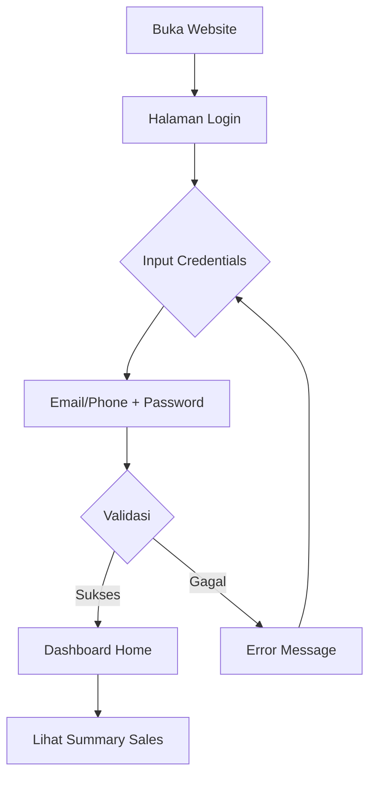
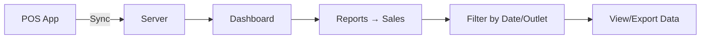
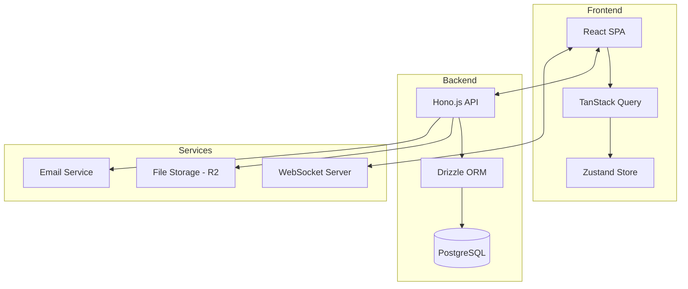

# Product Requirement Document (PRD)
## Hitachi Merchant POS Dashboard

---

## 1. Ringkasan Produk

**Hitachi Merchant POS Dashboard** adalah sistem manajemen bisnis berbasis web untuk merchant/retail yang mencakup:
- Point of Sale (POS) Management
- Inventory & Stock Control
- Sales Reporting & Analytics
- Employee Management
- Multi-Outlet Support

**Target Pengguna:**
- Pemilik bisnis retail/F&B
- Manager outlet
- Kasir & staff operasional
- Multi-outlet chain operators

---

## 2. User Flow

### 2.1 Flow Login → Dashboard



### 2.2 Flow Manajemen Produk

| Step | Aksi | Deskripsi |
|------|------|-----------|
| 1 | Login | Masuk ke dashboard |
| 2 | Buka Catalog → Catalog Item | Navigasi ke daftar produk |
| 3 | Klik "Create Item" | Buka modal form produk |
| 4 | Isi Detail Produk | Nama, kategori, brand, harga, outlet |
| 5 | Upload Gambar | Foto produk (opsional) |
| 6 | Set Modifier/Addon | Tambahan seperti topping, ukuran |
| 7 | Simpan | Produk tersedia di POS |

### 2.3 Flow Transaksi & Laporan



### 2.4 Flow Inventory Management

| Step | Aksi | Deskripsi |
|------|------|-----------|
| 1 | Inventory → Summary | Lihat stok keseluruhan |
| 2 | Purchase Order | Buat pesanan ke supplier |
| 3 | Transfer Stock | Pindah stok antar outlet |
| 4 | Adjustment | Koreksi stok manual |
| 5 | Serial/Expiry Tracking | Tracking batch products |

### 2.5 Flow Employee Management

1. **Employees → Employee List** - Daftar semua karyawan
2. **Create Employee** - Tambah karyawan baru dengan role
3. **Menu Management** - Atur akses menu per role
4. **PIN Access** - Set PIN untuk login POS
5. **Attendance** - Tracking kehadiran
6. **Commission** - Perhitungan komisi sales

---

## 3. Data Structure (Rough Schema)

### 3.1 Core Entities

```
┌─────────────────────────────────────────────────────────────────┐
│                        DATABASE SCHEMA                          │
└─────────────────────────────────────────────────────────────────┘

┌──────────────┐     ┌──────────────┐     ┌──────────────┐
│    Users     │     │   Outlets    │     │  Employees   │
├──────────────┤     ├──────────────┤     ├──────────────┤
│ id           │     │ id           │     │ id           │
│ email        │────▶│ owner_id     │◀────│ outlet_id    │
│ phone        │     │ name         │     │ name         │
│ password     │     │ address      │     │ email        │
│ role         │     │ phone        │     │ pin_code     │
│ created_at   │     │ settings     │     │ role         │
└──────────────┘     └──────────────┘     │ commission_% │
                                          └──────────────┘
```

### 3.2 Catalog & Product

```sql
-- Categories
categories (id, outlet_id, name, parent_id, sort_order)

-- Brands
brands (id, outlet_id, name, logo_url)

-- Catalog Items (Products)
catalog_items (
    id, outlet_id, sku, name, description,
    category_id, brand_id, 
    base_price, cost_price,
    tax_id, is_active,
    track_inventory, image_url
)

-- Modifiers (Addons)
modifiers (id, name, price, is_required)
item_modifiers (item_id, modifier_id)

-- Bundle Packages
bundles (id, name, price, items[])
```

### 3.3 Inventory

```sql
-- Stock per Outlet
inventory (
    id, item_id, outlet_id,
    quantity, min_stock, max_stock
)

-- Suppliers
suppliers (id, name, contact, address, email)

-- Purchase Orders
purchase_orders (
    id, supplier_id, outlet_id,
    status, total, order_date, received_date
)
purchase_order_items (po_id, item_id, qty, price)

-- Stock Transfers
stock_transfers (
    id, from_outlet, to_outlet,
    status, created_by, items[]
)

-- Stock Adjustments
adjustments (id, item_id, outlet_id, qty_change, reason)
```

### 3.4 Transactions & Sales

```sql
-- Transactions
transactions (
    id, outlet_id, employee_id,
    customer_id, table_id,
    subtotal, tax, discount, total,
    payment_method, status,
    created_at, shift_id
)
transaction_items (tx_id, item_id, qty, price, modifiers[])

-- Payment Methods
payment_methods (id, name, type, is_active)

-- Shifts
shifts (id, outlet_id, employee_id, start_time, end_time, cash_start, cash_end)
```

### 3.5 Supporting Entities

```sql
-- Customers
customers (id, name, phone, email, points, created_at)

-- Tables (for F&B)
table_groups (id, outlet_id, name)
tables (id, group_id, name, capacity, status)

-- Promos & Discounts
promos (id, name, type, value, start_date, end_date, conditions)
discounts (id, name, type, value, apply_to)
vouchers (id, code, discount_id, usage_limit, used_count)

-- Tax Configuration
taxes (id, name, rate, is_inclusive)

-- Additional Fees
additional_fees (id, name, amount, apply_to)
```

---

## 4. Tech Stack Recommendation

### 4.1 Recommended Stack

| Layer | Technology | Justification |
|-------|------------|---------------|
| **Frontend** | React 18+ | Component-based, ecosystem maturity |
| **State** | Zustand / TanStack Query | Lightweight, server-state sync |
| **Styling** | Tailwind CSS | Rapid development, consistent design |
| **Backend** | Hono.js | Ultra-fast, TypeScript native, edge-ready |
| **Database** | PostgreSQL | ACID compliance, complex queries, JSON support |
| **ORM** | Drizzle ORM | Type-safe, lightweight, PostgreSQL optimized |
| **Auth** | JWT + Refresh Token | Stateless, scalable |
| **Real-time** | WebSocket / SSE | Live POS sync |
| **File Storage** | S3/Cloudflare R2 | Product images, exports |

### 4.2 Architecture Diagram



### 4.3 Folder Structure

```
├── apps/
│   ├── web/                # React Dashboard
│   │   ├── src/
│   │   │   ├── components/
│   │   │   ├── pages/
│   │   │   ├── hooks/
│   │   │   └── stores/
│   │   └── package.json
│   │
│   └── api/                # Hono Backend
│       ├── src/
│       │   ├── routes/
│       │   ├── services/
│       │   ├── db/
│       │   └── middleware/
│       └── package.json
│
├── packages/
│   ├── db/                 # Drizzle Schema
│   └── shared/             # Shared Types
│
└── package.json            # Monorepo root
```

---

## 5. UI/UX Recommendations

### 5.1 Design System

| Aspect | Recommendation |
|--------|----------------|
| **Color Palette** | Dark sidebar (#1a1a2e) + White content area + Teal accent (#00b894) |
| **Typography** | Inter / Poppins untuk readability |
| **Icons** | Lucide React / Tabler Icons |
| **Layout** | Fixed sidebar + Scrollable content |
| **Tables** | Paginated dengan search & filter bar |
| **Forms** | Modal-based untuk create/edit |
| **Mobile** | Responsive collapse sidebar |

### 5.2 Key UX Improvements

> [!TIP]
> **Quick Actions**
> - Floating action button untuk aksi utama (Create Item, New Transaction)
> - Keyboard shortcuts untuk power users (Ctrl+N = New, Ctrl+S = Save)

> [!IMPORTANT]
> **Data Visualization**
> - Dashboard dengan chart interaktif (Revenue trend, Top products)
> - Real-time sales counter dengan animasi
> - Color-coded status badges

### 5.3 Navigation Structure

```
📊 Dashboard
├── Summary (Default view)
└── Outlet Comparison

🏠 Home

📈 Reports
├── Sales
├── Transactions
├── Shift
└── Commission

📦 Catalog
├── Payment Methods
├── Tax
├── Additional Fee
├── Sales Type
├── Brands
├── Catalog Item ⭐
├── Categories
├── Modifiers
├── Bundle Package
├── Promo
├── Discounts
└── Voucher

📦 Inventory
├── Summary
├── Suppliers
├── Purchase Order
├── Transfer Stock
├── Adjustment
├── Serial Number
└── Expiry Date

👥 Employees
├── Employee List
├── Menu Management
├── PIN Access
├── Attendance
└── Commission

🧪 Ingredient (New)
├── Ingredient Categories
├── Ingredient List
└── Recipes

⚙️ Configuration
├── Account
├── Outlet
├── POS Setting
├── Notification
└── Integration

👤 Customers
└── Customer List

🍽️ Table Management
├── Table Groups
└── Table List

💳 Subscription
📺 Customer Display
```

### 5.4 Responsive Considerations

| Screen Size | Behavior |
|-------------|----------|
| **Desktop (>1200px)** | Full sidebar visible |
| **Tablet (768-1200px)** | Collapsible sidebar with icons |
| **Mobile (<768px)** | Bottom navigation / Hamburger menu |

### 5.5 Accessibility

- Contrast ratio minimal 4.5:1
- Focus states visible untuk keyboard nav
- ARIA labels pada interactive elements
- Loading states dan skeleton screens

---

## 6. Recording & Screenshots

Berikut adalah rekaman eksplorasi dashboard:


---

## 7. Summary & Next Steps

### Fitur Inti yang Harus Diimplementasi:
1. ✅ Authentication & Multi-outlet support
2. ✅ Catalog Management (Items, Categories, Modifiers)
3. ✅ Inventory Tracking & Stock Control
4. ✅ Sales Reporting & Analytics
5. ✅ Employee Management dengan Role-based Access
6. ✅ Table Management untuk F&B

### Prioritas Development:
1. **Phase 1**: Auth, Outlet, Basic Catalog
2. **Phase 2**: Inventory, Transactions
3. **Phase 3**: Reports, Employees
4. **Phase 4**: Advanced features (Recipe, Integration)

---

*Document prepared as Senior Product Manager analysis*
*Date: 11 January 2026*
